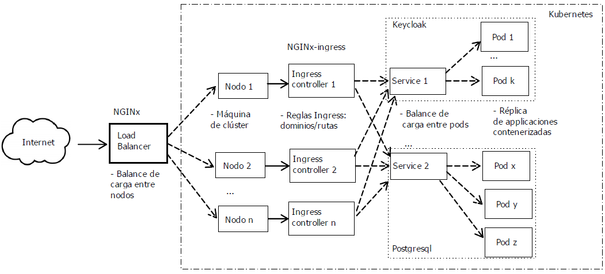
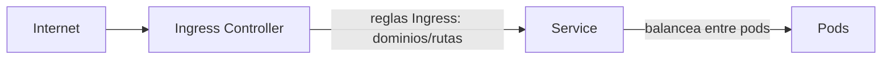

# Despliegue de KeyCloak en Production sobre un clúster de Kubernetes on premise.
La presente guía está pensada para desplegar Keycloak en producción desde cero. Esto es, partiendo del conjunto de máquinas limpias que conformarán el clúster.

Para comenzar, el tráfico en entornos on-prem (y en nube solo que son gestionados por el proveedor) es común tener un balanceador de carga que se encargue de distribuir el tráfico entre los nodos del clúster.
Cada uno de los nodos tiene un node port abierto que redirige el tráfico al ingress controller, este a los correspondientes servicios y estos a los pods. Por lo tanto, el flujo de tráfico sería así:

<div align="center">
    
</div>

Esto garantiza balanceo de carga tanto en los pods, como en los nodos, permitiéndote aumentar el número de nodos y pods según la carga de trabajo sin interrumpir el servicio ni tener que tocar ninguna configuración previa.

La guía está dividida en los siguientes apartados desplegables:


<details>
<summary> <b style="font-size:160%;"> Orquestador de contenedores (Kubernetes) </b> </summary>
<br>

Esta guía contiene los pasos para instalar Kubernetes on-premise usando máquinas virtuales como nodos para un entorno de producción.

Los requisitos mínimos y los recomendados para un cluster de Kubernetes:


## Ubuntu Server 24.04 con Containerd

### Nodos maestro
**NOTA:** Hasta el paso 11 todos los comandos se han ejecutado con el usuario root.

```
sudo su
```
A partir de este paso, se ejecutarán con el usuario normal que se haya creado en el sistema.
****
1. Actualizar paquetería e instalar requisitos previos:
```bash
apt update && apt upgrade -y

apt install curl apt-transport-https git wget software-properties-common lsb-release ca-certificates socat -y
```

2. Desactivar swap:
```bash
swapoff -a
sed -i '/swap/s/^\(.*\)$/#\1/g' /etc/fstab # Auto comenta la línea de swap en fstab
```

3. Cargar módulos necesarios del kernel y cargar configuración en sysctl: 
```bash
modprobe overlay
modprobe br_netfilter

cat << EOF | tee /etc/sysctl.d/kubernetes.conf
net.bridge.bridge-nf-call-ip6tables = 1
net.bridge.bridge-nf-call-iptables = 1
net.ipv4.ip_forward = 1
EOF
```

4. Aplicar configuración de sysctl y comprobar que se ha aplicado correctamente:
```bash
sysctl --system
```

5. Instalar las claves gpg de Docker para instalar containerd:
```bash
mkdir -p /etc/apt/keyrings

curl -fsSL https://download.docker.com/linux/ubuntu/gpg \
| sudo gpg --dearmor -o /etc/apt/keyrings/docker.gpg

echo \
"deb [arch=$(dpkg --print-architecture) signed-by=/etc/apt/keyrings/docker.gpg] \
https://download.docker.com/linux/ubuntu \
$(lsb_release -cs) stable" | sudo tee /etc/apt/sources.list.d/docker.list > /dev/null
```

6. Instalar containerd y configurar el daemon para que use cgroups de systemd:
```bash
apt update && apt install containerd.io -y

containerd config default | tee /etc/containerd/config.toml

sed -e's/SystemdCgroup = false/SystemdCgroup = true/g' -i /etc/containerd/config.toml

systemctl restart containerd
```

7. Instalar claves gpg de Kubernetes y añadir el repositorio:
```bash
mkdir -p -m 755 /etc/apt/keyrings

curl -fsSL https://pkgs.k8s.io/core:/stable:/v1.30/deb/Release.key \
| sudo gpg --dearmor -o /etc/apt/keyrings/kubernetes-apt-keyring.gpg
```

8. Añadir el repositorio de Kubernetes 1.30 (puedes cambiar la versión modificando las URLs):
```bash
echo "deb [signed-by=/etc/apt/keyrings/kubernetes-apt-keyring.gpg] \
https://pkgs.k8s.io/core:/stable:/v1.30/deb/ /" \
| sudo tee /etc/apt/sources.list.d/kubernetes.list

apt update
```

9. Instalar kubeadm, kubelet y kubectl:
```bash
apt install -y kubeadm=1.30.1-1.1 kubelet=1.30.1-1.1 kubectl=1.30.1-1.1

apt-mark hold kubelet kubeadm kubectl # Bloquear actualizaciones automáticas
```

10. Buscamos nuestra IP y la añadimos al fichero `/etc/hosts` con el nombre del nodo maestro (en mi caso `k8scp` como control plane pero le puedes dar el nombre que prefieras):
```bash
echo "<IP> k8scp" >> /etc/hosts
```

Puedes obtener tu ip con el comando `ip a`, `ip addr show` o `hostname -i`.

11. Iniciar el cluster con kubeadm (importante cambiar el rango de IPs para pods por uno que no esté en uso en tu red, evitar también el rango 10.XXX.XXX.XXX ya que es un rango reservado para redes privadas). Por último, añadimos el nombre del nodo maestro (recuerda usar el de antes) o directamente la ip del mismo y el puerto 6443:
```bash
kubeadm init --pod-network-cidr=<rango de IPs para pods> --control-plane-endpoint=<Nombre añañadido en el /etc/hosts>:6443

# Por ejemplo:
# kubeadm init --pod-network-cidr=192.168.0.0/16 --control-plane-endpoint=k8scp:6443 
```

En este punto se puede volver al usuario por defecto con 
```
exit
```

12. (Opcional) Configurar kubectl e instalar autocompletado:
```bash
mkdir -p $HOME/.kube

sudo cp -i /etc/kubernetes/admin.conf $HOME/.kube/config

sudo chown $(id -u):$(id -g) $HOME/.kube/config

sudo apt install bash-completion -y

source <(kubectl completion bash)

echo 'source <(kubectl completion bash)' >> ~/.bashrc # persistir autocompletado
```

Esto nos permitirá usar autocompletado en la terminal de bash y si tabulamos después de escribir `kubectl` nos mostrará las opciones disponibles.


13. Instalar Helm, necesario para instalar algunas aplicaciones en Kubernetes, incluido cilium (la CNI que vamos a instalar):
```bash
curl -fsSL https://packages.buildkite.com/helm-linux/helm-debian/gpgkey | gpg --dearmor | sudo tee /usr/share/keyrings/helm.gpg > /dev/null

echo "deb [signed-by=/usr/share/keyrings/helm.gpg] https://packages.buildkite.com/helm-linux/helm-debian/any/ any main" | sudo tee /etc/apt/sources.list.d/helm-stable-debian.list

sudo apt update

sudo apt install helm -y
```

14. Instalar cilium, una CNI que nos permitirá conectar los pods entre sí:
```bash
helm repo add cilium https://helm.cilium.io/

helm repo update

helm template cilium cilium/cilium --version 1.16.1 \
--namespace kube-system > cilium.yaml

kubectl apply -f cilium.yaml
```

15. (Opcional y no recomendado) Si quieres que tu nodo maestro también sea un nodo worker (es decir, que ejecute pods), puedes hacerlo con el siguiente comando:
```bash
kubectl taint nodes --all node-role.kubernetes.io/master-
kubectl taint nodes --all  node-role.kubernetes.io/control-plane-
```

Podríamos reactivar la restricción (taint) de que el nodo maestro no ejecute pods con el comando:
```bash
kubectl taint nodes --all node-role.kubernetes.io/master:NoSchedule
kubectl taint nodes --all node-role.kubernetes.io/control-plane:NoSchedule
```

16. (Opcional) En este punto es posible desplegar una herramienta complementaria que permite el control de Kubernetes a través de una interfaz web. Se trata de Headlamp, una alternativa al Dashboard oficial de K8s (descontinuado), y su instalación es mediante un chart de Helm.
``` bash
helm repo add headlamp https://kubernetes-sigs.github.io/headlamp/
helm install my-headlamp headlamp/headlamp --namespace kube-system
```
Crear una cuenta de servicio y conceder permisos de administrador:
```bash
kubectl -n kube-system create serviceaccount headlamp-admin
kubectl create clusterrolebinding headlamp-admin --serviceaccount=kube-system:headlamp-admin --clusterrole=cluster-admin
```
Para obtener un token de acceso (Kubernetes 1.24+):
```bash
kubectl create token headlamp-admin -n kube-system
```
Finalmente para acceder es necesario exponer el puerto de la aplicación mediante e introducir el token cuando lo pida.
```bash
kubectl port-forward -n kube-system service/my-headlamp 8080:80 --address 0.0.0.0
```

### Nodo worker
Esta parte de la instalació la haremos sobre el servidor que queramos añadir al cluster. En este caso, el nodo worker.

1. Repetir los pasos 1 a 10 del nodo maestro. **IMPORTANTE** Recuerda añadir la IP y el nombre del nodo maestro en el fichero `/etc/hosts`. Osea, exactamente igual que en el nodo maestro no lo adaptes a este nodo. 

2. Unir el nodo worker al cluster con el comando que nos proporcionó `kubeadm init` en el nodo maestro:
```bash
kubeadm join <Nombre del nodo maestro>:6443 --token <token> --discovery-token-ca-cert-hash sha256:<hash>
```

El token se puede obtener con el comando `kubeadm token list` lanzado en el nodo maestro. Si hubiera expirado, se puede generar uno nuevo con `kubeadm token create`.

El hash se puede obtener con el siguiente comando de openssl. Lo lanzamos en el nodo maestro:
```bash
openssl x509 -pubkey -in /etc/kubernetes/pki/ca.crt | openssl rsa -pubin -outform der 2>/dev/null | openssl dgst -sha256 -hex | sed 's/^.* //'
```

3. Comprobar que el nodo worker se ha unido correctamente al cluster. Lanza el siguiente comando en el nodo maestro. Es posible que tarde un poco en estar listo:
```bash
kubectl get nodes
```
</details>

<details>
<summary> <b style="font-size:160%;"> Controlador Ingress (NGINx-ingress) </b> </summary>
<br>

En Kubernetes, exponer aplicaciones al exterior puede hacerse de varias formas. Los **Services** permiten exponer pods dentro o fuera del clúster, pero si necesitas enrutar tráfico HTTP/HTTPS externo a diferentes servicios internos según el dominio o la ruta, necesitas un recurso adicional: **Ingress**.

## ¿Cómo se relacionan Service, Ingress e Ingress Controller?

- **Service**: expone y balancea el acceso a los pods. Puede ser interno (ClusterIP) o externo (NodePort, LoadBalancer).
- **Ingress**: define reglas de enrutamiento HTTP/HTTPS para exponer uno o varios servicios internos bajo una única IP/punto de entrada, gestionando rutas y dominios.
- **Ingress Controller**: es el componente (normalmente un pod) que observa los objetos Ingress y aplica las reglas, actuando como proxy inverso (por ejemplo, nginx).

### Diagrama visual del flujo de tráfico



- El tráfico externo llega al **Ingress Controller**.
- El **Ingress** define a qué **Service** debe enviarse cada petición según la ruta o dominio.
- El **Service** balancea el tráfico entre los pods correspondientes.

De este modo, puedes tener múltiples aplicaciones (web, API, etc.) expuestas bajo diferentes rutas o dominios, todas gestionadas de forma centralizada y segura.

Cualquier tecnología que sirviera como proxy inverso se puede utilizar como `ingress controller`. Uno de los más comunes es nginx.

[Ejemplos de configuración de nginx para diferentes plataformas ( docker desktop, minikube, AWS, GCP, Azure...)](https://github.com/kubernetes/ingress-nginx/blob/main/docs/deploy/index.md)

## Instalación de un ingress controller
Podemos instalar el ingress controller basado en nginx con [[helm]]. 

Domentación oficial: [ingress-nginx](https://docs.nginx.com/nginx-ingress-controller/installation/installing-nic/installation-with-helm/)

Primero, añadimos el repositorio de charts de nginx ingress:
``` bash
helm repo add ingress-nginx https://kubernetes.github.io/ingress-nginx
helm repo update
```

Seguidamente, ejecutamos el siguiente comando para instalar el ingress controller de nginx:
``` bash 
helm install nginx-ingress ingress-nginx/ingress-nginx \
  --namespace ingress-nginx \
  --create-namespace \
  --set controller.service.type=NodePort \
  --set controller.ingressClassResource.name=nginx \
  --set controller.ingressClass=nginx
```

Ahora ya podemos añadir objetos de tipo `ingress` en kubernetes.
</details>

<details>
<summary> <b style="font-size:160%;"> Balanceador de carga (Load Balancer) </b> </summary>
<br>

Muchas veces antes de plantearse el uso de un orquestador como Kubernetes ya existe previamente configurado un Load Balancer que siguen los lineamientos de seguridad de la organización. Aunque con Kubernetes es posible desplegar un Load Balancer en el clúster que expondría el servicio al mundo, aquí configuraremos un Load Balancer externo para simular una configuración habitual. 

## NGINx con Docker-compose

En este caso específico usaremos NGINx como la tecnología detrás del balanceador de carga de entre todas las opciones que existe y lo desplegaremos usando docker-compose.

## Prerequisitos
* Docker y git tienen que estar instalados en la máquina host
  * Siga las indicaciones del siguiente [link](https://docs.docker.com/engine/install/ubuntu/) para instalar Docker correctamente
* Acceso para configurar los registros de un dominio u obtener uno temporal en https://www.duckdns.org/domains 

## Clone este repositorio
```
git clone https://github.com/alexisimo/keycloak-k8s.git
```
Los recursos para el despliegue de NGINx se encuentran en el directorio *load-balancer*.

## Listar los nodos del clúster
Dentro del fichero [load-balancer/nginx.conf](./load-balancer/nginx.conf) en el apartado *upstream* se listarán las direcciones IP y los puertos que apuntan a los servicios de Ingress dentro de Kubernetes.

- Para obtener las ip de cada nodo puedes usar cualquiera de los comandos siguientes:  `ip a`, `ip addr show` o `hostname -i` en el terminal de cada nodo.

- Para obtener el puerto hay que ejecutar en un nodo master lo siguiente:
```bash
kubectl -n ingress-nginx get svc
```
Dependiendo de si se está sirviendo HTTP o HTTPS tomamos nota del puerto del servicio de tipo LoadBalancer de nombre *ingress-nginx-controller*.

El resultado del bloque de configuración debería asemejarse a lo siguiente:
```bash
...
    upstream backend_servers {
        ip_hash;
        server 999.111.222.39:32014;
        server 999.111.222.40:32014;
        server 999.111.222.41:32014;
        server 999.111.222.42:32014;
        ...
    }
...
```
De esta forma el Load Balancer repartirá las peticiones por todos los nodos hacia el Controlador Ingress dentro de Kubernetes que a su vez dirigirá el tráfico hacia el servicio que corresponde a cada aplicación, en este caso Keycloak.


## Correr el servidor de NGINx

```shell
  cd load-balancer
  docker compose up -d
```

## Habilitar NGINx para que funcione sobre HTTPS con SSL
En función de cómo se encuentre configurada la red por encima de Keycloak, puede haber un mecanismo que redirija el portal HTTP a HTTPS con los certificados configurados en otra capa. O bien, si se trata de la primera capa de encriptación habría que obtener y apuntar en la configuración de NGINx los certificados SSL. En el segundo caso, habría que obtenerlos por ejemplo con Certbot e indicar a NGINx dónde se encuentran.

### Obtención de un certificado SSL Certificate usando Certbot:
Instale Certbot y obtenga el certificado SSL para su dominio. Asegúrese de que su máquina host es accesible desde el internet. 
```shell
  # Instale Certbot 
  sudo apt-get update
  sudo apt-get install certbot

  # Obtenga un certificado SSL para su dominio
  # sudo certbot certonly --standalone -d <Keycloak server domain> -m <your email> --agree-tos
  sudo certbot certonly --standalone -d site-domain.com -m test@gmail.com --agree-tos
```
En el fichero [docker-compose.yaml](./load-balancer/docker-compose.yaml) se debe quitar el comentario en la última línea, esto habilita el volumen donde se generan por defecto los certificados y sus claves.

Además en el fichero [nginx.conf](./niginx-compose/nginx.conf) hace falta asegurarse de que en la configuración del servidor los parámetros correspondientes a los certificados apunten correctamente a donde se encuentran guardados dentro de la máquina host.


```
server_name site-domain.com;
ssl_certificate "/etc/letsencrypt/live/site-domain.com/fullchain.pem";
ssl_certificate_key "/etc/letsencrypt/live/site-domain.com/privkey.pem";
```

</details>

<details>
<summary> <b style="font-size:160%;">Instalación de Keycloak </b> </summary>
<br>

Antes de proceder a la instalación de Keycloak en el clúster de Kubernetes hay que asegurarse de tener suficientes recursos en cuanto a memoria y CPU provistos para Keycloak. Como una guía para asegurarase del correcto dimensionamiento del sistema en producción puedes visitar la documentación específica para ello en [Concepts for sizing CPU and memory resources](https://www.keycloak.org/high-availability/single-cluster/concepts-memory-and-cpu-sizing).

## Despliegue de Keycloak con kubectl
Se ha incluído un fichero de configuración de Keycloak para su despliegue con kubectl en el directorio [./keycloak](./keycloak/) bajo el nombre [values.yaml](./keycloak/values.yaml).

```bash
cd keycloak
kubectl create -f values.yaml
```

Si quieres revertir el despliegue con ejecutar el siguiente comando lo tienes.

```bash
kubectl delete -f values.yaml
```


</details>

